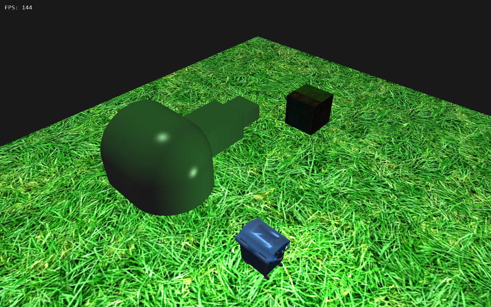

# Jet-Land Engine #

This is my own 3D engine written in C++ based on DirectX API.

Features implemented:
* Material System
* Phong Lighting
* Memory Pooling System
* `.ini` configuration system
* XML Scene Descriptor
* OBJ Mesh Support
* JMH (Custom made Jet-Land Engine Mesh Format)
* Timer Utility
* Instant/Accumulated Framerate Counter
* FPS Shooter Camera Control
* MSAA support

